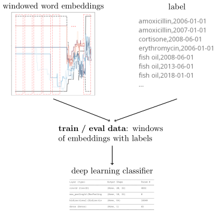
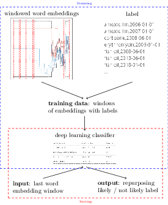

# Using word evolution to predict drug repurposing

This repository describes the process associated with the [2023 paper](#citing-the-paper) on using word evolution to predict drug repurposing. The pipeline for the approach is shown in the diagram below and the individual stages are described below.



The paper describes a model which is evaluated on a withheld portion of the data. 

### Creation of dynamic word embeddings

[Continuously Evolving Embeddings](https://github.com/cod3licious/evolvemb) can be built by chronologically ordering PubMed abstracts using the `pubmed_abstracts.py` (*nix) script:

```
python pubmed_abstracts.py -p <pubmed_baseline_dir> -o <path_to_compressed_output_file>

-p Full path to PubMed baseline directory (containing *.xml.gz files)
-o Full path to output file (will be given .gz extension if missing)
```

The chronologically organized output can be passed as input to the dynamic word embedding script due to Horn (2021), available as [evolvemb](https://github.com/cod3licious/evolvemb), which creates a `.pkl` file containing the generated embeddings.

### Repurposing annotation

Using [SemMedDB](https://lhncbc.nlm.nih.gov/ii/tools/SemRep_SemMedDB_SKR/SemMedDB_download.html), SemRep parsed PubMed articles, and [UMLS](https://www.nlm.nih.gov/research/umls/licensedcontent/umlsknowledgesources.html) (for mapping the CUIs output by SemRep), instances of repurposing can be identified using the following script:

```
python semrep_repurposing_identification.py -p <predication_filepath> -c <citation_filepath>

-p Full path to semmedDB download of PREDICATION.csv.gz
-c Full path to semmedDF download of CITATIONS.csv.gz
-u Full path to UMLS META directory (containing RRF files MRCONSO and MRSTY)
-o Full path to output file (will be given .csv extension if missing)
```

This creates a text file showing instances of repurposing as identified using new treatment associations.

### Prepare training data

The full interval dynamic embeddings are turned into a CSV input that can be passed to the deep learning model. This requires a number of UMLS files to be present - the `<umls_dir>` refers to the directory which contains a MRCONSO.RRF file.

```
python prepare_embeddings.py -p <pkl_file> -u <umls_dir> -o <output_file>

-p Full path to pkl file produced by evolvemb
-u Full path to directory which contains MRCONSO.RRF
-o The output location (.csv will be added if missing)
```

This requires `evolvemb` to be installed as a module in the same directory, and the `gensim` package to be available in the environment.

### Train deep learning classifier

The deep learning classifier, which requires `keras` and `tensorflow` packages, can be trained and evaluated using the script:

```
python evolution_repurposing.py -r <treatment_path> -e <embedding_path> -o <dataset_path>
-r Full path to treatment dates file
-e Full path to embedding file
-s Quantity of history to take into account
-o Full path to output file
```

Aside from the dataset used in training, the output contains the classification report describing the model's performance on withheld data.

## Using the classifier to predict potential repurposing

The model trained above can be, with some slight adjustment, used to classify new inputs. The pipeline would require the model to be saved, which would then allow it to be used to classify new data. This is shown in the figure below:



## Citing the paper

If you found any of this code helpful, please consider citing the paper:

```
@unpublished{Preiss:2023,
  AUTHOR = {Judita Preiss},
  TITLE = {Using word evolution to predict drug repurposing},
  YEAR = 2023}
```

